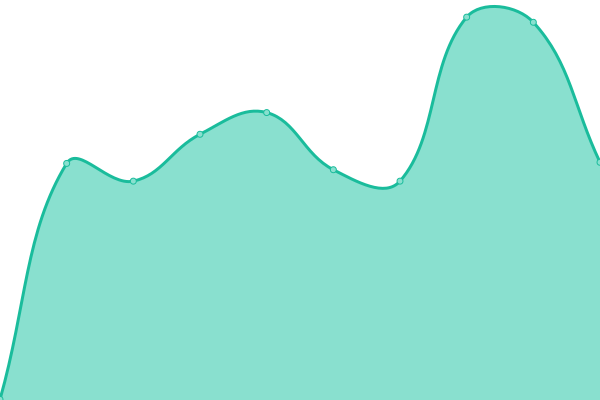
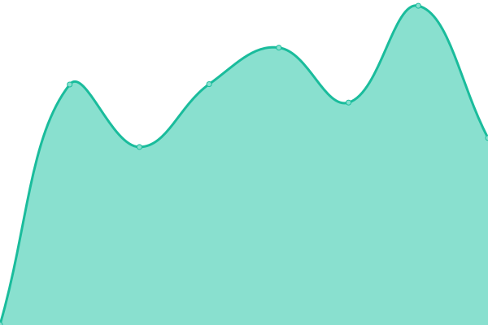
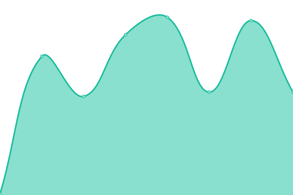

# [📈 Live Status](https://status.erdbeerbaerlp.de): <!--live status--> **🟩 All systems operational**

This repository contains the open-source uptime monitor and status page for [Upptime](https://upptime.js.org), powered by [Upptime](https://github.com/upptime/upptime).

With [Upptime](https://upptime.js.org), you can get your own unlimited and free uptime monitor and status page, powered entirely by a GitHub repository. We use [Issues](https://github.com/upptime/upptime/issues) as incident reports, [Actions](https://github.com/ErdbeerbaerLP/status-page/actions) as uptime monitors, and [Pages](https://status.erdbeerbaerlp.de) for the status page.

<!--start: status pages-->
<!-- This summary is generated by Upptime (https://github.com/upptime/upptime) -->
<!-- Do not edit this manually, your changes will be overwritten -->
<!-- prettier-ignore -->
| URL | Status | History | Response Time | Uptime |
| --- | ------ | ------- | ------------- | ------ |
|  [Maven Repo](https://repo.erdbeerbaerlp.de) | 🟩 Up | [maven-repo.yml](https://github.com/ErdbeerbaerLP/status-page/commits/HEAD/history/maven-repo.yml) | 

 525ms
     
 | 

<a href="https://status.erdbeerbaerlp.de/history/maven-repo">83.49%</a>
    

|  [Discord Integration API](https://api.erdbeerbaerlp.de/dcintegration/) | 🟩 Up | [discord-integration-api.yml](https://github.com/ErdbeerbaerLP/status-page/commits/HEAD/history/discord-integration-api.yml) | 

 512ms
     
 | 

<a href="https://status.erdbeerbaerlp.de/history/discord-integration-api">100.00%</a>
    

|  [Mastodon](https://mastodon.erdbeerbaerlp.de) | 🟩 Up | [mastodon.yml](https://github.com/ErdbeerbaerLP/status-page/commits/HEAD/history/mastodon.yml) | 

 708ms
     
 | 

<a href="https://status.erdbeerbaerlp.de/history/mastodon">100.00%</a>
    

|  [Switch LAN-Play Server](erdbeerbaerlp.de) | 🟩 Up | [switch-lan-play-server.yml](https://github.com/ErdbeerbaerLP/status-page/commits/HEAD/history/switch-lan-play-server.yml) | 

 211ms
     
 | 

<a href="https://status.erdbeerbaerlp.de/history/switch-lan-play-server">100.00%</a>
    

|  [Discord Integration Minecraft Server](erdbeerbaerlp.de) | 🟩 Up | [discord-integration-minecraft-server.yml](https://github.com/ErdbeerbaerLP/status-page/commits/HEAD/history/discord-integration-minecraft-server.yml) | 

 143ms
     
 | 

<a href="https://status.erdbeerbaerlp.de/history/discord-integration-minecraft-server">100.00%</a>
    

<!--end: status pages-->

[**Visit our status website →**](https://status.erdbeerbaerlp.de)

## 📄 License

- Powered by: [Upptime](https://github.com/upptime/upptime)
- Code: [MIT](./LICENSE) © [Upptime](https://upptime.js.org)
- Data in the `./history` directory: [Open Database License](https://opendatacommons.org/licenses/odbl/1-0/)
